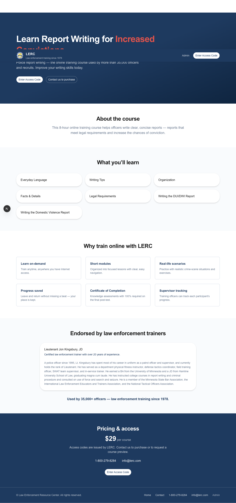
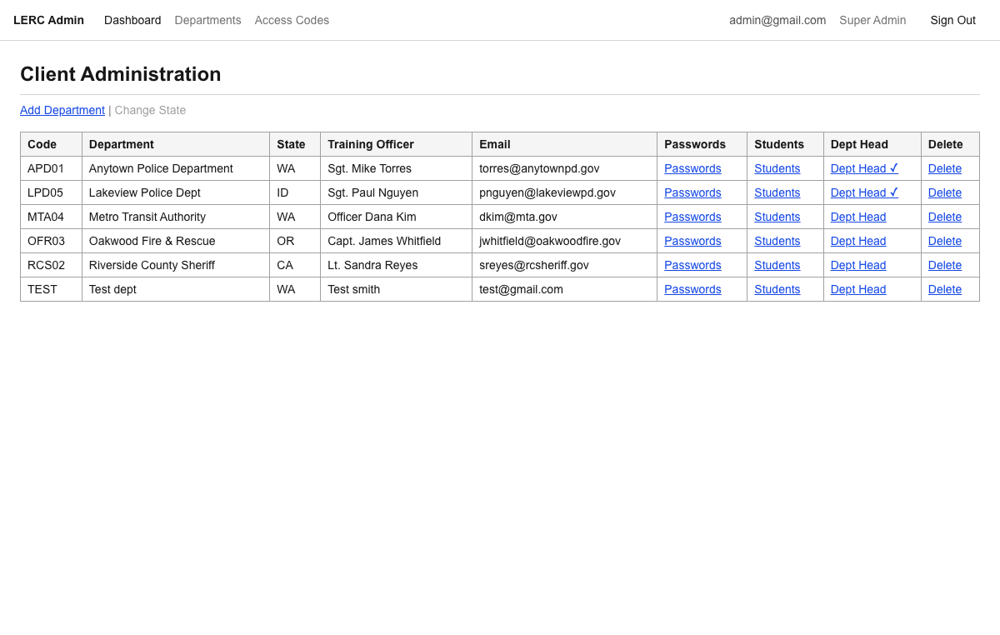

<div align="center">

# 🛡️ LERC Platform — Engineering Case Study

### A production training-and-certification platform for law-enforcement agencies — a legacy Classic ASP system rebuilt, solo, on a modern security-hardened stack.


**Role:** Sole developer (contract) · **Timeline:** ~6 weeks

</div>

> **Note on the source code.** This is a **case study**, not the source repository. LERC is paid
> contract work, so the application code and the client's course content live in a **private repo**.
> Happy to walk through the architecture, the security model, or specific code in an interview, or to
> grant repo access on request.

---

<div align="center">



</div>

## Overview

**LERC** delivers an online report-writing certification course used by law-enforcement agencies to
train and certify officers (the course has served **35,000+ officers since 1978**). The engagement
replaced a legacy **Classic ASP** system with a modern web application — built end-to-end as the
**sole developer**, owning requirements, architecture, security, implementation, testing, and deployment.

The product spans **five surfaces**: a public marketing/order page, an access-code **student course
flow** (247 pages across 8 chapters with interactive practice quizzes), a graded **final-exam** path
with certificate generation, an **admin console**, and a **department-head portal** for tracking
officer progress.

## Why it's interesting: security-first design

Officers don't have individual accounts, agencies share networks, and the exam is a real
certification — so the interesting engineering is in the **trust model**, not CRUD.

### Dual authentication

Two separate auth systems for two user classes:

- **Admins** → Supabase Auth + **PostgreSQL row-level security (RLS)** for role-scoped, department-isolated data.
- **Officers** → a custom **access-code login** that mints an **HMAC-SHA256-signed session cookie**.
  The signature *is* the session — **no session table, no shared server state** — so it stays correct
  across serverless instances.

### Anti-cheat exam engine

The graded exam is hardened against forgery, answer-swapping, and double-submission:

- Questions are served with an **HMAC-signed token** binding the exact question IDs to that
  student + chapter.
- On submit: verify the signature → enforce **single-use via a DB unique constraint *before* grading**
  → check submitted IDs match served IDs → **never return correct answers on a fail** (with instant
  retakes, leaking them would be an answer oracle).
- Per-user **Redis rate limiting** (Upstash) on the grading path.

### Correctness under concurrent load

Every contended write is guarded by a **real database constraint**, not app-level read-then-write:

```sql
-- Progress can never regress on backward navigation (monotonic guard)
UPDATE enrollment_progress
   SET current_page = $newPage
 WHERE user_id = $u AND chapter = $c
   AND current_page < $newPage;

-- Exam token replay protection enforced at the database, not in app logic
CREATE UNIQUE INDEX ux_used_quiz_tokens ON used_quiz_tokens (token_id);
```

*(Illustrative patterns — generic engineering, not client content.)*

## Admin console

Multi-department administration — access codes, per-department passwords, department-head
assignment, and progress oversight (shown with **demo data**):



## Architecture

```
                 ┌─────────────── Next.js 16 (App Router) ───────────────┐
   Public  ▶     │  Marketing / order page                                │
   Officer ▶     │  Student course flow  →  Practice quizzes  →  Final exam │──▶ Certificate
   Admin   ▶     │  Admin console                                          │
   Dept-head ▶   │  Department progress portal                             │
                 └───────────────┬───────────────────────┬────────────────┘
                     Server Actions / RSC          HMAC session cookies
                                 │                         │
                 ┌───────────────▼─────────────┐   ┌───────▼────────┐
                 │  Supabase / PostgreSQL       │   │  Upstash Redis │
                 │  14-table schema · RLS       │   │  rate limiting │
                 │  50 forward-only migrations  │   └────────────────┘
                 └──────────────────────────────┘
                         Deployed on Vercel (GitHub CI/CD)
```

- **Content migration pipeline:** a Node/TypeScript tool converted 247 pages of legacy ASP markup into
  sanitized semantic HTML through a curated `sanitize-html` allowlist (XSS + UI-redress protection),
  re-implementing interactive quizzes as React components.
- **Data layer:** a normalized **14-table schema** with **50 forward-only migrations** and
  data-integrity constraints enforcing correctness at the database.

## Tech stack

**Frontend:** Next.js 16 (App Router, Server Components & Server Actions), React 19, TypeScript,
Tailwind CSS v4, shadcn/ui, React Hook Form, Zod
**Backend / Data:** Supabase / PostgreSQL (row-level security), 50 migrations, Upstash Redis
**Security:** dual auth, HMAC-SHA256 signing, single-use tokens, rate limiting, XSS mitigation, threat modeling
**Cloud / Infra:** Vercel (serverless + CI/CD), Vercel Blob, Resend (email)
**Testing:** Vitest (405 tests), ESLint, TypeScript

## Engineering footprint

- **405** automated tests (auth, grading, concurrency) · **~12,600** lines of TypeScript
- **50** forward-only DB migrations · **14**-table schema
- **95** commits / **45** merged PRs · **~6 weeks**, solo
- **247** pages / **8** chapters of legacy content migrated

## What I owned

Everything — as the sole developer, I reverse-engineered requirements from an undocumented legacy
system, designed the architecture and the security model, built all five surfaces, wrote the test
suite, and shipped to production on Vercel with GitHub-based continuous deployment. I ran an
adversarial security review on every feature and migration before merge, and treated tests, lint,
type-check, and build as non-negotiable release gates.

---

<div align="center">
<sub>Case study for portfolio purposes. Application source and course content are private (client contract).</sub>
</div>
